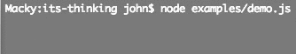

# Its Thinking

Spinner module for Node terminal applications

Fork of [wemakeweb/node-spinner](https://github.com/wemakeweb/node-spinner),
a port of [visionmedia/go-spin](https://github.com/visionmedia/go-spin) to node.
Also, heavily influenced by [helloIAmPau/node-spinner](https://github.com/helloIAmPau/node-spinner)

## Installation

### 1. Install via package manager
```
$ npm install its-thinking
```

### 2. Include in code
```js
var ItsThinking = require("its-thinking");
```

## Examples



See _examples_ directory for more.


### Basic Usage

```js
var basicSpinner = new ItsThinking();
basicSpinner.start("Thinkin' 'bout numbers... ");
//And when you're done...
basicSpinner.stop();
```

## Interval
By default, the pattern updates every 250 milliseconds, but that can change by passing a second argument to start.

```js
var longSpinner = new ItsThinking();
longSpinner.start("Thinkin' long and hard 'bout numbers... ", 2000);
```

## Patterns

Uses one of the built-in patterns by passing in an index (0 - 16)
```js
var arrowSpinner = new ItsThinking(16);
arrowSpinner.start("Thinkin' 'bout arrows... ");
```

...or provide a custom string
```js
var vowelSpinner = new ItsThinking("aeiou");
vowelSpinner.start("Thinkin' 'bout vowels... ");
```

...or a custom array.
```js
var moreVowelSpinner = new ItsThinking(["a","e","i","o","u","sometimes y"]);
moreVowelSpinner.start("Thinkin' 'bout other vowels... ");
```

Access built-in patterns directly.

```js
var trippyPattern = ItsThinking.Patterns[11].split("").map(function(item){return "[~> " + item + " <~]"});
var trippySpinner = new ItsThinking(trippyPattern);
trippySpinner.start("Thinkin' 'bout...");
```


# License

 MIT
